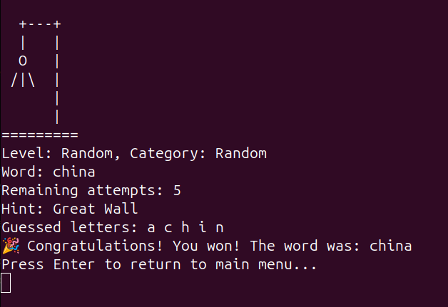
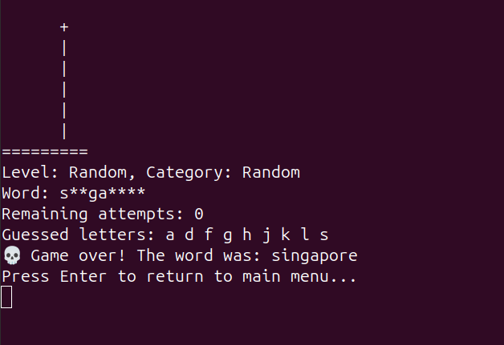

# 🪢 Hangman

Консольная игра «Виселица» на Go. Угадывай слова по буквам, пока не закончились попытки.

## Screenshots

**Игровой процесс**

<figure>
    
    <figcaption>Победа. Слово отгадано.</figcaption>
</figure>

<figure>
    
    <figcaption>Поражение. Закончились попытки.</figcaption>
</figure>

## Quick Start

```bash
# Клонировать репозиторий
git clone https://github.com/kurochkinivan/hangman.git
cd hangman

# Запустить игру
go run ./cmd/hangman
```

## Режимы запуска

**Интерактивный режим** — стандартная игра в консоли:
```bash
go run ./cmd/hangman
```

**Тестовый (неинтерактивный) режим** — передай загаданное и угаданное слово аргументами:
```bash
go run ./cmd/hangman <загаданное_слово> <угаданное_слово>
# Вывод: у*а*а**ое;win / у*а*а**ое;lose
```

## Функциональность

- Выбор **категории** и **уровня сложности** — вручную или случайно
- Пошаговая **визуализация виселицы** в терминале
- Система **подсказок** — введи `hint` во время игры
- Слова хранятся в `words.yaml` — легко расширять словарь
- Ввод регистронезависимый

## Запуск тестов

```bash
go test ./...
# или через Makefile
make test
```